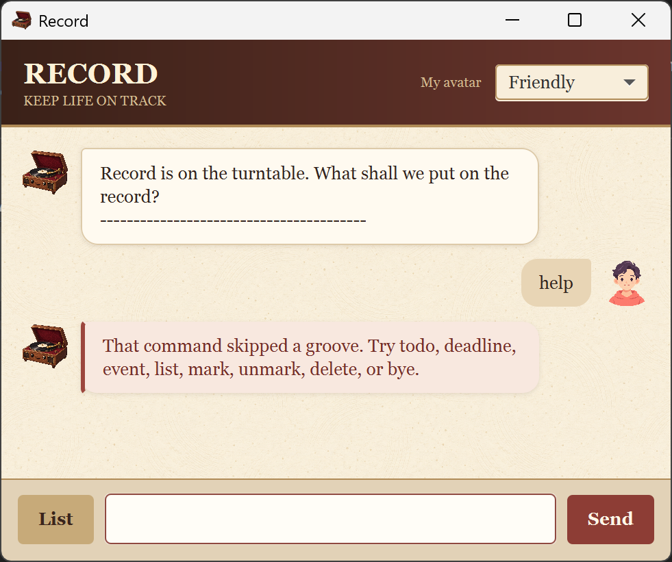
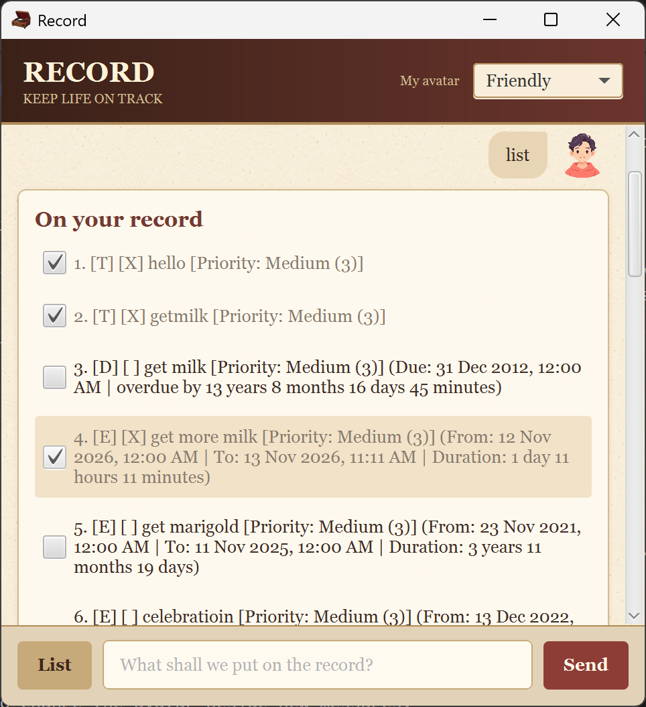

# Record User Guide

Record is a desktop task manager that keeps to-dos, deadlines, and events together in a conversational interface. This guide assumes you are using Record for the first time.




## Quick start

1. Launch Record. Your previously saved tasks load automatically.
    > java -jar Record.jar
2. Type a command in the box at the bottom.
3. Press **Enter** or select **Send**.
4. Select **List** at any time to see all tasks and their completion checkboxes.

Commands are not case-sensitive, but task descriptions keep their capitalization. Dates use `yyyymmdd`; times use 24-hour `hh:mm`. An omitted time means `00:00` (midnight).

## Command summary

| Action | Format | Example |
| --- | --- | --- |
| Add a to-do | `todo DESCRIPTION [DATE] [TIME] [/priority PRIORITY]` | `todo Buy groceries 20260920 18:30 /priority 2` |
| Add a deadline | `deadline DESCRIPTION /by DATE [TIME] [/priority PRIORITY]` | `deadline Submit report /by 20260921 23:59 /priority high` |
| Add an event | `event DESCRIPTION /from DATE [TIME] /to DATE [TIME] [/priority PRIORITY]` | `event Project meeting /from 20260922 14:00 /to 20260922 15:00` |
| Show tasks | `list` or the **List** button | `list` |
| Complete a task | `mark NUMBER` or select its checkbox | `mark 2` |
| Reopen a task | `unmark NUMBER` or clear its checkbox | `unmark 2` |
| Delete a task | `delete NUMBER` | `delete 2` |
| Clear the conversation | `clear` | `clear` |
| Exit and save | `bye` | `bye` |

Capitalized words are placeholders; do not type the labels themselves. Items in square brackets are optional.

## Adding a to-do

Use a to-do for a task without a deadline:

```text
todo Read chapter 4
```

You may put an optional schedule at the end of the description:

```text
todo Call Sam 20260920 19:30
```

Set an optional priority with `/priority`:

```text
todo Buy concert tickets /priority high
```

## Adding a deadline

Use `/by` followed by a date and optional time:

```text
deadline Submit assignment /by 20260925 23:59
```

The `/by` option is required. Invalid dates such as `20260230` and times such as `25:00` produce a warning.

## Adding an event

Events require both a start and an end:

```text
event Team presentation /from 20260926 10:00 /to 20260926 11:30
```

Options may appear in any order, so this is also valid:

```text
event /to 20260926 11:30 /priority 1 Team presentation /from 20260926 10:00
```

The end must be at or after the start. Each of `/from`, `/to`, and `/priority` may appear at most once; Record warns you about duplicates.

## Setting priority

Priority is optional and defaults to Medium. Use its name or number:

| Number | Name |
| --- | --- |
| 1 | High |
| 2 | Medium-High |
| 3 | Medium |
| 4 | Low-Medium |
| 5 | Low |

Names are not case-sensitive. `/priority LOW` and `/priority 5` are equivalent.

## Viewing and updating tasks

Enter `list` or select **List**. Every row shows its number, type (`T`, `D`, or `E`), completion state, description, priority, and relevant dates.



Select a checkbox to complete a task, or use its displayed number:

```text
mark 1
unmark 1
delete 1
```

After deletion, later numbers shift up. Open the list again if you are unsure of a number.

## Conversation controls

- Press **Up** and **Down** in the command box to revisit recent commands. Record retains the latest 100 commands for the session.
- Enter `clear` to remove visible conversation messages. This does **not** delete tasks.
- Use the avatar selector to change the avatar beside new messages.

## Saving and recovery

Record loads `data/listdata.txt` at startup and saves there when you enter `bye`. Missing folders are created automatically. The storage component also supports current-folder, parent-folder, and nested relative paths.

Record rejects unreadable, oversized, corrupted, and unsupported save files instead of partially importing them. If loading fails, check file permissions or restore a valid backup; avoid manually editing the save file.

Use `bye` before closing whenever possible so the latest changes are saved.

## Input limits

- Commands: at most 10,100 characters.
- Task descriptions: at most 10,000 characters.
- Task list: at most 100,000 tasks.
- Save file: at most 256 MB.
- Command history: latest 100 commands.

These limits are designed to keep retained data below 1 GB and should not affect normal use.

## Common errors

| Problem | What to do |
| --- | --- |
| Empty or unknown command | Type a command from the summary. |
| Missing description | Add text describing the task. |
| Missing `/by`, `/from`, or `/to` | Add the required option and date. |
| Invalid date or time | Use a real `yyyymmdd` date and optional 24-hour `hh:mm` time. |
| Repeated option | Keep only one copy of that slash option. |
| Event end before its start | Correct `/from` or `/to`. |
| Invalid item number | Enter `list`, then use a displayed number. |
| Save file cannot be read | Check that `data/listdata.txt` is a readable file and that you have access permission. |

## Exiting

Enter `bye`. Record saves the list, shows its farewell message, and closes.
